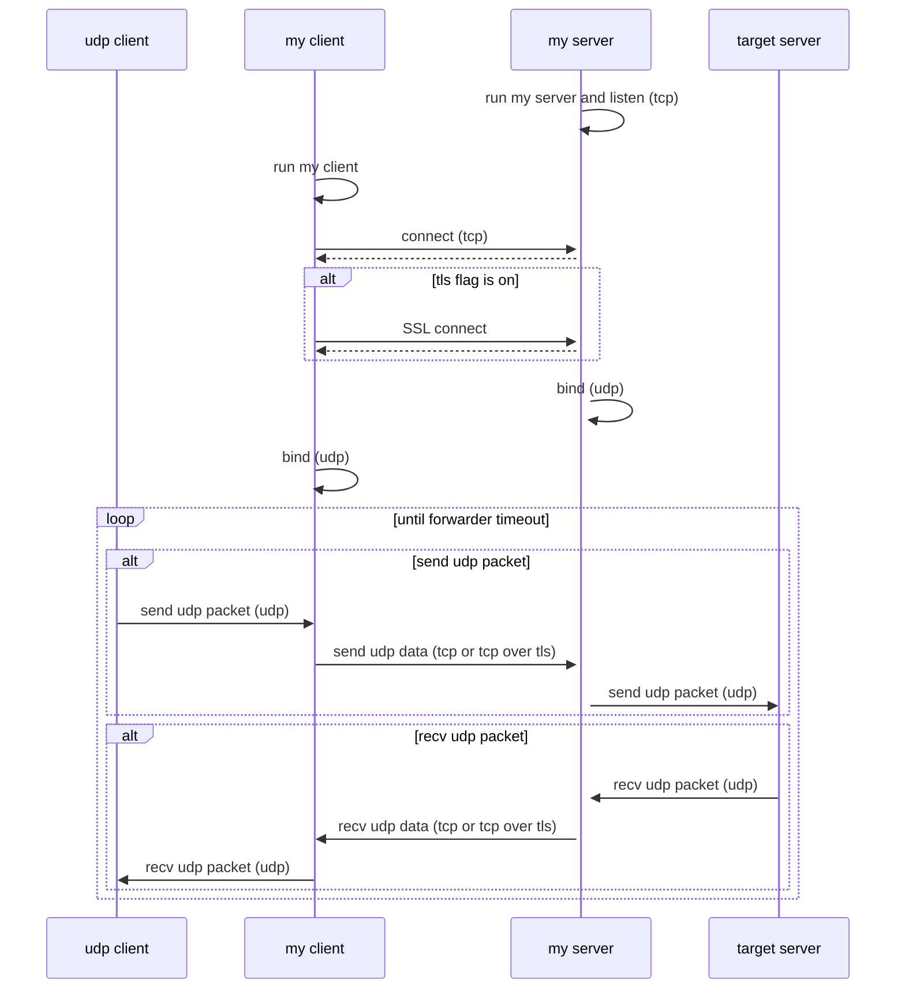
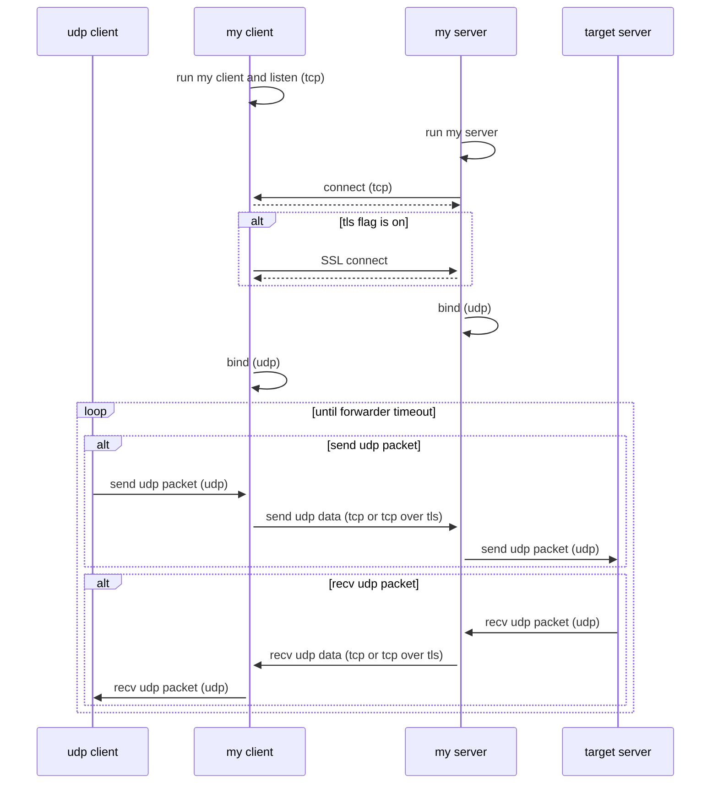

# udp packet forwarder

udp packet forwarder (ipv4, ipv6)

This tool does not forward icmp and icmpv6 packets (Port unreachable, etc.).

## How it works
### Normal mode (client -> server)

### Reverse mode (client <- server)

## License
This project is licensed under the MIT License.

See the [LICENSE](https://github.com/shuichiro-endo/udp-packet-forwarder/blob/main/LICENSE) file for details.

